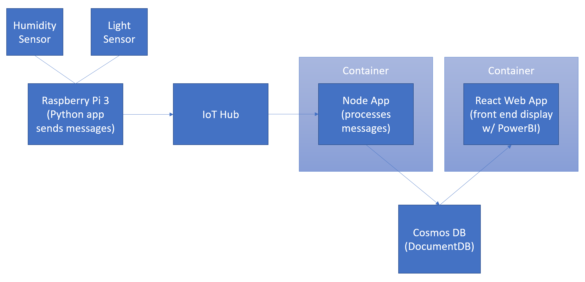

# IoT Plant Watering and Monitoring System

## System Architecture

There are several options for supporting the various components for this project.

### Plant Sensor Device
For the plant sensor device itself, we opted to go with manually distributing and loading the Python application onto the Raspberry Pi 3. A more robust solution would be to provide an online location to download the software, or an automated CI/CD solution that would update the devices over the air, however that was outside of the scope of this project. For simplicity, this project is located in a [separate repository](https://github.com/jcocchi/HumiditySensor) with it's own setup instructions.

### Data Collection Process
Azure IoT Hub and Event Hubs were selected as the most turnkey way to stream data collected on the Pi from the devices to the cloud.  

### Data Storage
CosmosDB was selected as the long term storage for the data collected from the devices via IoT Hub. This database is accessed by the front-end Web Application via PowerBI Embedded for reviewing and interacting with the sensor data. Other options could have included a VM running MongoDB, Azure Table storage or SQL Database on Azure. 

### Node API (Recieve Hub Messages)
This node application listens for messages recieved by the IoT Hub and writes the data into the CosmosDB database. Options for supporting this application include:

- Azure Functions
- Guest Executable on a Service Fabric Cluster
- API App (Azure App Services)
- Container on Service Fabric Cluster
- Container on Azure Container Service
- Native Application on Azure VM

### Node Web App (Front End Display)
This application provides a front end interface for viewing and interacting with the data collected from the plant sensors. Options for supporting this application include:

- Web App (Azure App Services)
- Native Application on Azure VM
- Guest Executable on Service Fabric Cluster
- Container on Service Fabric Cluster
- Container on Azure Container Service

## [Additional Details](/InfrastructureOptions.md) Regarding Node Application Deployment Options

## [What's in This Repo](/RepoContents.md)