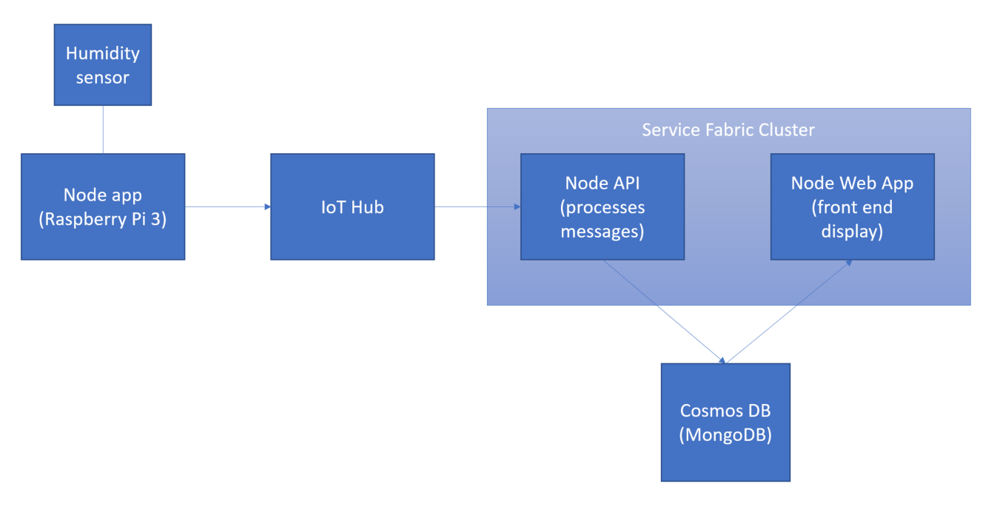

# IoT Plant Watering and Monitoring System

## Architecture Diagram

The system architecture is subject to change, most notably in how the messages get transferred from IoT Hub to Cosmos DB.

There are several options for supporting the various components for this project.

**Plant Sensor Device** - For the plant sensor device itself, we opted to go with manually distributing and loading the Node application onto the Raspberry Pi 3 manually. A more robust solution would be to provide an online location to download the software, or an automated CI/CD solution that would update the devices over the air, however that was outside of the scope of this project.

**Data Collection Process** - Azure IoT Hub was selected as the most turnkey way to collect data from the devices.  

**Data Storage** - CosmosDB was selected as the long term storage for the data collected from the devices via IoT Hub. This database would be accessed by the front-end Web Application for reviewing and interacting with the sensor data. Other options could have included VM running MongoDB, Azure Table storage or SQL Database on Azure. 

**Node API (Recieve Hub Messages)** - This node application performs to action of gathering messages recieved by the IoT Hub and moving them into the CosmosDB database.  Options for supporting this application include:
    * Azure Functions
    * Guest Executable on a Service Fabric Cluster *(Depicted in Diagram)*
    * API App (Azure App Services)
    * Container on Service Fabric Cluster
    * Container on Azure Container Service
    * Native Application on Azure VM

**Node Web App (Front End Display)** - This application provides a front end interface for viewing and interacting with the data collected from the plant sensors.  Options for supporting this application include:
    * Web App (Azure App Services)
    * Native Application on Azure VM
    * Guest Executable on Service Fabric Cluster *(Depicted in Diagram)*
    * Container on Service Fabric Cluster
    * Container on Azure Container Service

[Additional details](/InfrastructureOptions.md) regarding Node Application deployment options.