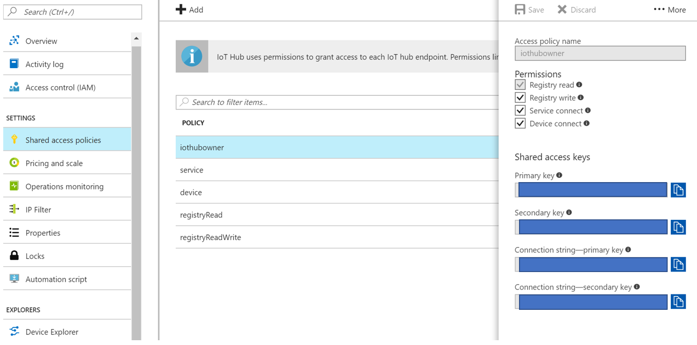

# App To Read and Process Messages from the IoT Event Hub

This app will listen to the IoT Event Hub and will record any incoming messages in CosmosDB using the DocumentDB API. Currently, the app will only record messages sent through the hub after this app was started as opposed to also reading old messages sitting in a queue.

## Download NPM Dependencies

To run this project first download [Node.js](https://nodejs.org/en/) and clone this repo on your machine. Then npm install all of the project dependencies by following the below command line instructions.

```terminal
cd YOUR\CLONE\LOCATION\ReceiveHubMessages
npm install
```

## Fill in Environment Variables

The `.env.sample` file lists all of the necessary project environment variables. Create a matching `.env` file and fill in the necessary values.

The first environment variable value, EVENT_HUB_CONN_STRING, comes from your instance of Azure IoT Hub. This connection string is the same for the entire hub independent of which devices are connected and sending in messages. All messages for all devices connected to the hub will be picked up, read, and processed. To find the connection string, log in to the Azure portal and navigate to the Shared Access Policies -> iothubowner pane on your IoT Hub instance. It should look something like this.


- EVENT_HUB_CONN_STRING= The connection string for your event hub using your primary key

The next two environment variables come from your DocumentDB instance of CosmosDB. To find them, log in to the Azure portal and navigate to the Keys pane on your CosmosDB. It should look something like this.


- COSMOS_HOST= The URI value

- COSMOS_AUTH_KEY= The Primary Key value

- COSMOS_DATABASE_ID= This is the name of the database you want to connect to

- COSMOS_COLLECTION_ID= This is the name of the collection you want to connect to inside of the above database

## Run the Project

Follow the below command line instructions to run this project.

```terminal
cd YOUR\CLONE\LOCATION\ReceiveHubMessages
node index.js
```

You should see the below terminal output if the project is running successfully.

```terminal
Created partition receiver: 3
Created partition receiver: 2
Created partition receiver: 1
Created partition receiver: 0
```

> Note: This project only recieves messages from the hub that were made after it started running. To send mock messages and see this project in action follow the steps below.

### Send Mock Messages for This Project to Recieve and Process

If you don't have a real device connected to the hub and sending messages, you can run the simulated device project in this repository to test the system. 

Similar to this project, the simulated device has npm packages to install and one environment variale to set for the hub connection. Visit the README for that project for more information on how to run it.