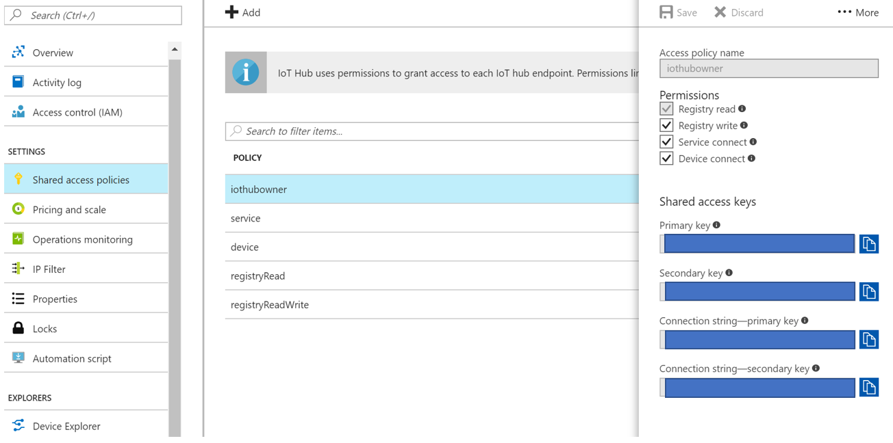

# Simulated Device to Send Messages to IoT Hub

This app simulates an IoT device and sends messages to the IoT Hub for processing.

## Download NPM Dependencies

To run this project first download [Node.js](https://nodejs.org/en/) and clone this repo on your machine. Then npm install all of the project dependencies by following the below command line instructions.

```terminal
cd YOUR\CLONE\LOCATION\SimulatedDevice
npm install
```

## Fill in Environment Variables

The `.env.sample` file lists all of the necessary project environment variables. Create a matching `.env` file and fill in the EVENT_HUB_CONN_STRING value, which comes from your instance of Azure IoT Hub. This connection string is the same for the entire hub independent of which devices are connected and sending in messages. To find the connection string, log in to the Azure portal and navigate to the Shared Access Policies -> iothubowner pane on your IoT Hub instance. It should look something like this.


- EVENT_HUB_CONN_STRING= The connection string for your event hub using your primary key

## Run the Project

Follow the below command line instructions to run this project.

```terminal
cd YOUR\CLONE\LOCATION\SimulatedDevice
node index.js
```

You should see the below terminal output if the project is running successfully.

```terminal
Client connected
Sending message: {"deviceId":"myFirstNodeDevice","light":23.61103355422305,"hum":66.3049
7111072552}
send status: MessageEnqueued
Sending message: {"deviceId":"myFirstNodeDevice","light":24.12934875272096,"hum":61.0394
60536754504}
send status: MessageEnqueued
...
```

> Note: This project only sends messages to the hub. To read and process these messages follow the instructions on the [Receive Hub Messages README](https://github.com/jcocchi/IoTPlantWatering/tree/master/ReceiveHubMessages).
