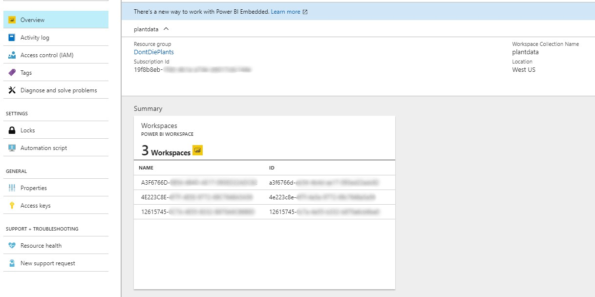
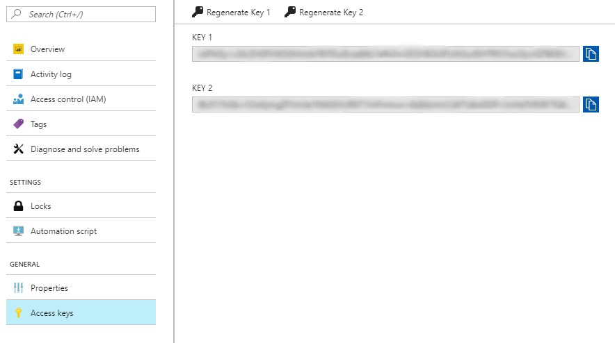

# React Website 

This is the front end website to display data gathered from humidity and light sensors in plants. The website skeleton was built using the[create-react-app](https://www.npmjs.com/package/create-react-app) npm package.

## Download NPM Dependencies

To run this project first download [Node.js](https://nodejs.org/en/) and clone this repo on your machine. Then npm install all of the project dependencies by following the below terminal commands.

```terminal
cd YOUR\CLONE\LOCATION\clientwebapp
npm install
```

## Fill in Environment Variables

The `.env.sample` file lists all of the necessary project environment variables. Create a matching `.env` file and fill in the necessary values. Most of the values can be found in the Azure portal in your Power BI Workspace Collection instance.



 - REACT_APP_PBI_WRKSPACE_ID= This is the id of the workspace that your report is a part of.
 - REACT_APP_PBI_WRKSPACE_COLL_NAME= Thi is the name of your workspace collection, not the name of your specific workspace in that collection. `plantdata` from this example.



 - REACT_APP_PBI_WRKSPACE_KEY= This is the access key for your workspace collection. You can use either Key 1 or Key 2.


 - REACT_APP_PBI_REPORT_ID= This is the ID of the report you uploaded to your workspace shown above in Azure. You can't get this ID from the portal. If you don't know it, use the [Power BI Command Line Tool](https://github.com/Microsoft/PowerBI-Cli) `get-reports` command.


## Run the Project

To run this project navigate to the `clientwebapp` folder and enter `npm start` from the terminal. The project is running on `http://localhost:3000`.