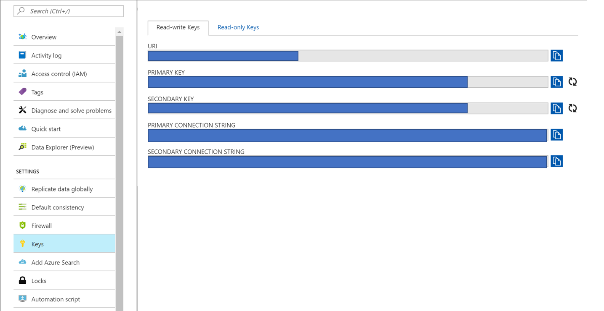

# React Website with Node Backend

This is the front end website to display data gathered from humidity sensors in plants. The website structure was created following this [blog post](https://www.fullstackreact.com/articles/using-create-react-app-with-a-server/) about creating a full stack React website with a Node.js backend.

## Download NPM Dependencies

To run this project first download [Node.js](https://nodejs.org/en/) and clone this repo on your machine. Then npm install all of the project dependencies for both the server and the client by following the below terminal commands.

```terminal
cd YOUR\CLONE\LOCATION\clientwebapp
npm install

cd client
npm install
```

Becase we are using [concurrently](https://www.npmjs.com/package/concurrently) and [create-react-app](https://www.npmjs.com/package/create-react-app) we need to install them both as global dependencies on your machine.

```terminal
npm install -g concurrently
npm install -g create-react-app 
```

## Fill in Environment Variables

The `.env.sample` file lists all of the necessary project environment variables. Create a matching `.env` file and fill in the necessary values.

- PORT= 
This is the port that your server application is listening on. If left blank, the application defaults to 3001. This is not to be confused with the port your client web app is using, that port defaults to 3000 and doesn't currently have an environment variable that can modify it.

The next two environment variables come from your DocumentDB instance of CosmosDB. To find them, log in to the Azure portal and navigate to the Keys pane on your CosmosDB. It should look something like this.


- COSMOS_HOST= The URI value

- COSMOS_AUTH_KEY= The Primary Key value

- COSMOS_DATABASE_ID= This is the name of the database you want to connect to

- COSMOS_COLLECTION_ID= This is the name of the collection you want to connect to inside of the above database

## Run the Project

You can run both the server and the client at the same time thanks to the concurrently npm package we installed earlier. This project will run cross platform.

There are several scrips in the `clientwebapp/project.json` file of this project that will easily allow you to run the complete project using `npm start`, or just the server and just the client using `npm server` and `npm client` respectively. 

> Note: Be sure you are in the `clientwebapp` folder when running all of these commands and not the nested `client` folder.